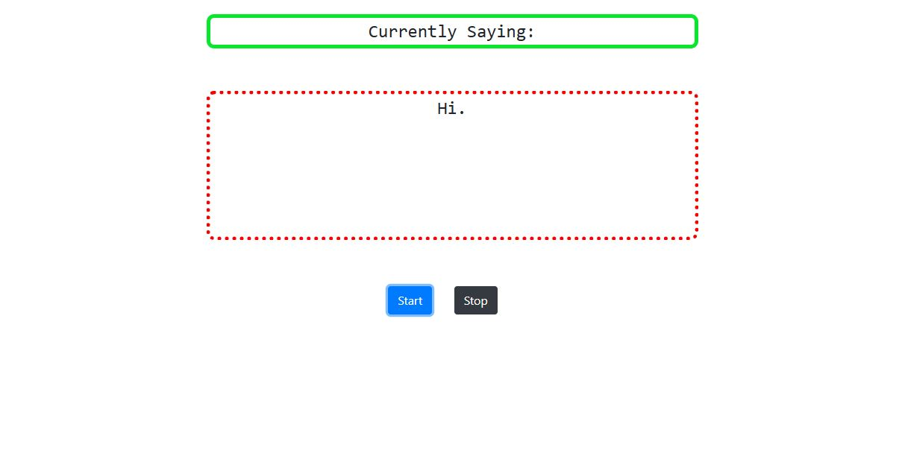

<h1>Voice to Text convertor</h1>

Simple Voice to Text convertor written in HTML, CSS, and JavaScript .

### Use of the Project:

 voice-to-text converter transcribes spoken language into written text, enhancing accessibility and efficiency. It benefits users by enabling hands-free operation, facilitating note-taking, and supporting individuals with disabilities.

<h3>Used Technologies</h3>
<ul>
  <li>HTML5</li>
  <li>CSS3</li>
  <li>JavaScript</li>
</ul>

<h3> ScreenShot </h3> 

  
